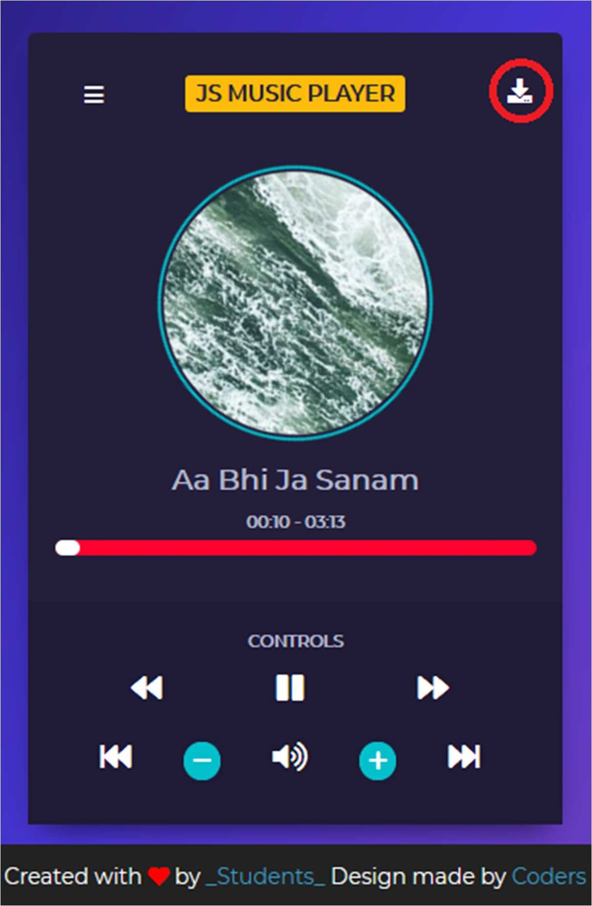

# MP3 Music Player
It is Web-Based MP3 Music Player. This project has several features like you can loop, repeat or shuffle a song, play/pause a song or play the next or previous song. You can view your music list and also know which song is currently playing and you can also select the song from the list to play.

## Project Specifications
- Create UI for music player including spinning image and song detail popup
- Add play and pause functionality
- Switch Music
- Progress Bar
- Download Music

Note: If music are not playing change the source website in the array from js file.

## Screenshots

## Developed By
- Swarup Kanade [@swarupkanade](https://www.github.com/swarupkanade)
- Omkar Kanade [@omkarkanade](https://www.github.com/omkarkanade)